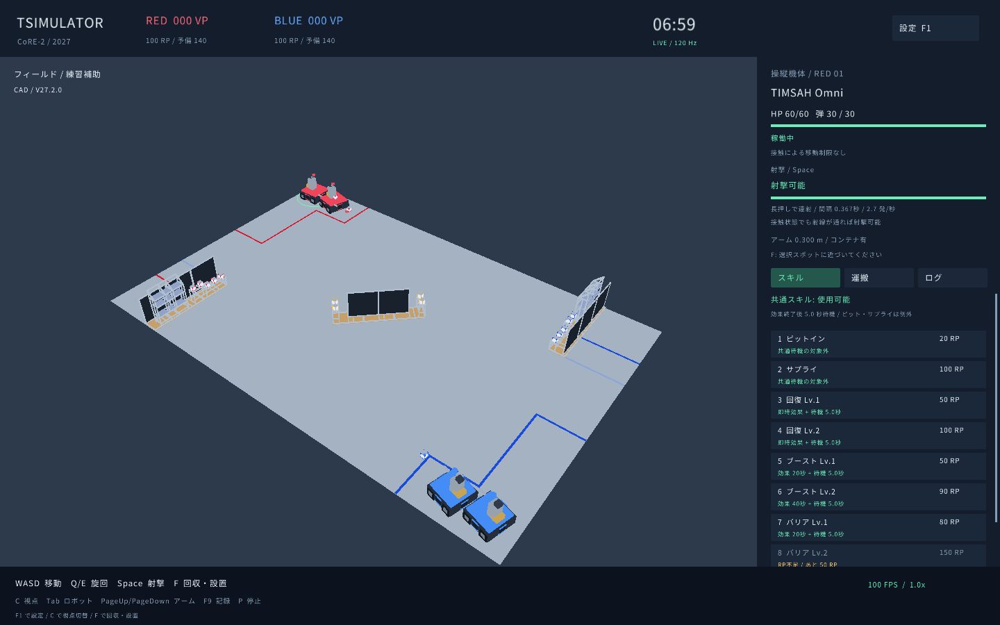

# TSimulator

.NET 10で動く、CoRE-2向けの3D練習シミュレーター。**CoRE-2 2027 V27.2.0** の競技判定と公式CADの読込に対応します。Windows x64、Linux x64、macOS Apple Silicon / Intelを対象としています。



## 起動

[Releases](https://github.com/jrt-timsah-org/TSimulator/releases)からOSに合うZIPを展開し、Windowsは`TSimulator.Desktop.exe`、Linuxは`TSimulator.Desktop`、Macは`TSimulator.app`を起動します。.NETランタイムは同梱です。LinuxではOpenGL 3.3以上とX11環境が必要です（Wayland環境ではXWayland）。

開発環境では.NET 10 SDKを導入し、次を実行します。

```bash
dotnet restore --locked-mode
dotnet run --project src/TSimulator.Desktop -c Release
```

ルールナビのCAD由来フィールド・コンテナモデルを同梱しています。設定の「CAD・記録」→「公式CADを取得」で再取得・更新できます。モデルがない場合も、寸法に基づく簡略モデルで起動できます。再取得したCADはユーザー領域に保存します。ユーザー領域はWindowsのLocalAppData、Linuxの`~/.local/share/TSimulator`、Macでは.NETのLocalApplicationData配下の`TSimulator`です。設定画面で実際の場所を確認できます。

## 操作

| 操作 | 初期キー |
|---|---|
| 前後・左右への移動 | W / S / A / D |
| 機体旋回 | Q / E |
| カメラ方向 | 矢印キー、右マウスドラッグ |
| 射撃 | Space |
| コンテナ回収・選択スポットへの設置 | F |
| アーム上下 | PageUp / PageDown |
| コンテナを落とす | G |
| 視点切替（ロボット→全体→追従） | C |
| 操縦するロボットを切替 | Tab |
| スキル | 1〜9、右パネルのボタン |
| 一時停止 / ラウンド再開 | P / R |
| 非常停止（当該ラウンド中保持） | X |
| 設定 / シナリオ再読込 | F1 / F5 |
| 記録開始・終了 | F9 |

すべての上記キーは設定で変更・保存できます。キー重複時は割当を入れ替えます。ロボット視点ではカメラの範囲内で射出ジンバルも向きます（左右±0.8rad、上下−0.3〜0.5rad）。観戦・追従視点では機体の正面に射出します。マウスホイールで追従距離を変えられます。

コンテナはアーム先端を近づけて回収します。設置時は自陣棚に近づき、右パネルでスポット番号を選択し、アーム高さを下段0.300m・中段0.625m・上段0.850mに合わせます。設置済みのコンテナは取り出せません。床に落としたコンテナはアーム最下端300mmの制限により回収できません。

ピットインは20RPを消費して入場を許可し、自陣補給ゾーンに機体全体が収まってから20秒間停止します。終了時に同盟の予備ディスクから補充します。サプライは予備ディスクを追加し、直接マガジンに装填しません。両陣の壁には開放された端から回り込んでください。

## 自由な調整

設定から機体サイズ、走行・旋回性能、射出速度・高さ・間隔、装弾数、空力係数、風、カメラを変更できます。「変更を適用」は新しいラウンドを開始します。「設定を保存」はキーと画面設定を保存します。機体・物理・競技設定は「シナリオをJSONに保存」で保存します。

`config/core2-semifinal.json`（2対2）、`config/core2-final.json`（3対3）、`config/sandbox.json`を例に、自作シナリオを指定できます。

```bash
dotnet run --project src/TSimulator.Desktop -c Release -- --scenario config/sandbox.json
```

JSONの`extraObstacles`で障害物を追加できます。`robot.modelPath`に自作OBJ/GLB/glTFの絶対パスを指定すると機体表示を差し替えられます。座標はメートル、+Y上、機体正面+X、原点は機体床面です。`modelScale`で調整してください。表示モデルの形状とは独立して`width`・`depth`・`height`から衝突形状を作ります。JSONの`rules`で競技パラメータ、`physics`で空力・風・同時ディスク数を変更できます。`sandbox`では競技サイズ・射出速度制限を外せます。

## 記録、無描画実行、性能計測

F9は新しいラウンドを開始し、毎tickの入力をJSONLに記録します。再度F9または終了時に状態ハッシュを保存します。

```bash
dotnet run --project src/TSimulator.Cli -c Release -- simulate --seconds 420 --record artifacts/match.jsonl
dotnet run --project src/TSimulator.Cli -c Release -- replay artifacts/match.jsonl
dotnet run --project src/TSimulator.Cli -c Release -- benchmark --scenario config/core2-final.json --seconds 420
dotnet run --project src/TSimulator.Cli -c Release -- validate config/sandbox.json
dotnet run --project src/TSimulator.Cli -c Release -- assets fetch assets/models/official
```

同じ実装・同じCPU系統で再実行した状態ハッシュを照合します。CPU・OSをまたぐ浮動小数点のビット単位一致は保証しません。未完了・改変されたリプレイは検証エラーになります。

## 開発と配布

```bash
dotnet build TSimulator.slnx -c Release
dotnet test TSimulator.slnx -c Release
dotnet run --project src/TSimulator.Desktop -c Release -- --smoke 10 --no-official --screenshot artifacts/smoke.png
```

PR/PushのCIで3OS・4アーキテクチャのビルド、競技・物理・再生テスト、ネイティブライブラリ読込を検証します。描画スモークテストはLinuxの仮想画面で実行します。Windows・MacのGitHub仮想環境には必要なOpenGL描画機能がないため、両OSの実機描画は別途確認が必要です。`v*`タグをPushすると各OSの自己完結ZIP、SHA-256、GitHub Releaseを自動生成します。手動でもworkflow_dispatchでビルドできます。Mac版は`.app`形式です。配布物は未署名で、Appleの公証は行っていません。

Mac版の起動対象はmacOS 14以降で、サポート中のmacOS 15以降を推奨します。OSの対応状況は[.NET 10の公式対応表](https://github.com/dotnet/core/blob/main/release-notes/10.0/supported-os.md)も参照してください。

描画ライブラリへの依存はDesktopのみ。競技・物理・入力はCore、無描画実行とツールはCliです。独自制御は`IRobotController`を実装して`PracticeBot`と差し替えられます。詳しくは[設計](docs/architecture.md)、[ルール対応](docs/rules.md)、[開発手順](CONTRIBUTING.md)を参照してください。

## 精度と実装範囲

走行は平面上の運動学モデル、接触はOBB、射撃は抗力・揚力を係数化した近似で、実機の校正データは付属しません。公式CADの見た目を利用しますが、棚や壁の衝突は単純化した形状です。大会全体の同盟合流・出撃履歴、人の故意を判断する審判行為、センサ振動の誤検知、機体の転倒や部品の変形、ネットワーク対戦は実装対象外です。CoRE-1は現在未対応です。俯瞰・追従視点、ミニマップ、ロボット切替は練習用の補助で、実大会の操縦条件とは異なります。

独立した練習用ソフトです。ルールの出典は[CoRE-Rulebook](https://github.com/scramble-robot/CoRE-Rulebook)と[公式ルールナビ](https://core.scramble-robot.org/rule/core-2-rulenavi/)。コードはMIT、フォントはOFL、同梱・取得CADは上流の権利に従います（利用者による自由利用の許可確認に基づき同梱）。[第三者素材](THIRD_PARTY_NOTICES.md)を参照してください。
