# Architecture

```mermaid
flowchart LR
    Desktop[Desktop / raylib / input / settings] --> Core[Core / fixed-tick simulation]
    Cli[CLI / batch / CAD import / replay] --> Core
    Tests[xUnit / rules / collisions / replay] --> Core
    Profiles[Scenario JSON] --> Core
    Controllers[IRobotController] --> Core
    Core --> Render[GPU cached meshes / interpolation]
    Core --> Replay[JSONL commands + state hash]
```

## Boundaries

- **Core** depends only on .NET BCL. `RuleProfile` holds rulebook facts, `RobotSpec` and `PhysicsSettings` hold adjustable empirical values. `Scenario.Validate()` runs before every session replacement; invalid edits preserve the current simulation.
- **ActionState** provides side-effect-free control, firing, interaction and skill availability queries used by both command execution and the HUD. Robot operating phase, movement contact, shot feedback, active alliance effects and post-effect cooldown are distinct states. Diagnostics do not enter the simulation hash. Shooting traces the launch corridor before flight; a blocked wall corridor preserves ammo and a touching robot cannot be skipped by the muzzle spawn point. Format-1 replay compatibility retains the original behavior.
- **RobotModules** loads validated, bounded declarative module packs, composes exactly one module per slot, and produces a resolved `RobotSpec`. `RobotOverrides` supports per-robot profiles. Module IDs remain recipe metadata: running simulations and recorded scenarios depend only on resolved specs. User packs override bundled IDs without changing slots. The desktop builder owns previews, editing, local preset persistence and validation feedback.
- **Simulation** steps at a fixed 120Hz by default. Timers are integer tick deadlines. Render frames accumulate wall time and consume a bounded number of ticks; visual interpolation uses previous/current positions. A slow frame cannot cause unbounded catch-up work. This intentionally slows simulated time on sustained overload.
- **Geometry** contains OBB/SAT robot contact and segment/expanded-OBB disc tests. Contact uses the closest swept fraction to prevent fast projectiles bypassing thin panels or nearer walls. Collision and graphics coordinate system is metres, +Y up, red start corner origin, robot front +X.
- **Controllers** are `IRobotController` implementations; the bundled `PracticeBot` is deterministic and replaceable. Human and bot commands share `RobotCommand`, so controls do not bypass the rules engine. Machine integration can use the same commands without the window layer.
- **Desktop** owns all raylib handles and the graphics context. OBJ meshes use a bounded managed parser, bypassing the native OBJ loader that stalled during validation. Meshes and textures are retained on the GPU and released before closing the window. Resizing recreates only the viewport render texture. Custom robot files are loaded once and cached. A downloaded CAD cache is reloaded only when its background task completes, on the graphics thread.
- **CLI** supports validation, batch simulation, benchmarking, replay verification and optional official model import. It requires no graphics library or display.
- **Replay** records a scenario header followed by each fixed-tick command array, and a footer with tick count and full live-state hash. Truncation and divergence are errors. Format version is explicit. Floating-point identity across different architectures is not a promise.
- **HUD / RobotBuilder** are separate partials from window/input lifecycle. Scroll clipping also restricts button hit testing. Settings overlays and pickers block clicks beneath them. Pausing, losing focus, opening settings and switching controlled robots clear pending one-shot commands. Numeric and modular editing share an explicit selected/all-robot target.
- **OfficialAssets** extracts only JSON values from the public page; it never runs page JavaScript. Mesh buffer lengths and index ranges are checked. A source-version change fails explicitly instead of silently using an unknown layout. The CAD-derived field and container geometry is bundled with the user-confirmed permission; user refreshes are saved as separate local caches.

## Performance

Current collision broad phase is simple iteration: robot pair tests O(N²), projectiles O(projectiles × (robots + obstacles)). Intended arena size is 4–6 robots; configurable sandbox maximum is 32. Projectile capacity defaults to 2,048. Projectiles use a preallocated list and swap-remove. Static CAD is uploaded once. Contact details are simplified for responsiveness.

The CLI reports wall duration, ticks/second and current-thread allocations for a reproducible headless workload. Bot decision code uses LINQ and allocates; a future large-scale controller should cache target queries and use a spatial index. Do not present a headless benchmark as GPU FPS or validated real-time behavior on all machines.

## Portability and release

.NET 10 + Raylib-cs 8.1.0 / raylib 6.0 provide native bindings for linux-x64, win-x64, osx-arm64 and osx-x64. Each artifact is built, unit-tested and checked for native-library loading on a matching GitHub runner. Linux additionally runs GPU drawing through Mesa/Xvfb. GitHub Windows and Mac virtual runners cannot create the required OpenGL context; their GUI rendering requires physical-machine verification. Release archives contain .NET runtime, platform-native library, font/OFL, profiles and notices. Mac archives contain an `.app` bundle with an Info.plist; signing/notarization is not configured. CI publishes only after all matrix build jobs succeed.

A semantic version tag triggers publishing. Keep current replay compatibility when possible; use a new format/version when changing semantics. Libraries are pinned by package lock files. SDK uses a .NET 10 feature-band roll-forward. No Unity editor, external game engine or service is required.

The Linux CI also plays a bounded, validated raylib input script (`tests/ui/builder-flow.rae`) through the actual window. It assembles and saves a robot, applies it, records firing, saves the scenario, rebinds a key and resizes to 1100×760. A separate user directory prevents changes to normal user settings. `scripts/verify-ui-flow.py` checks the saved artifacts and the CLI verifies the resulting recording. The smoke script parser accepts only keyboard, mouse and bounded resize events.
